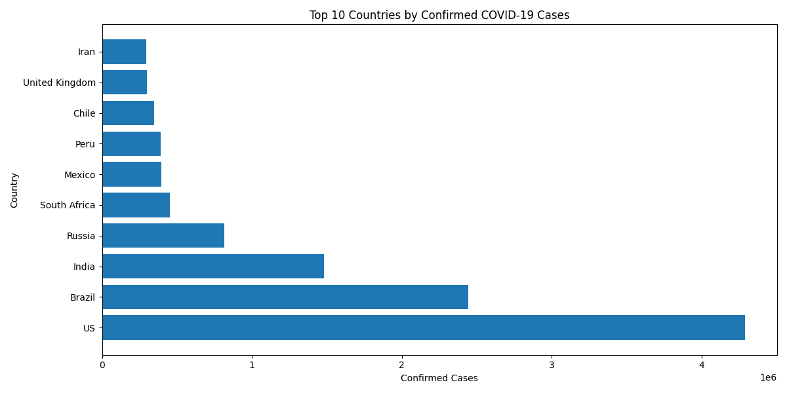
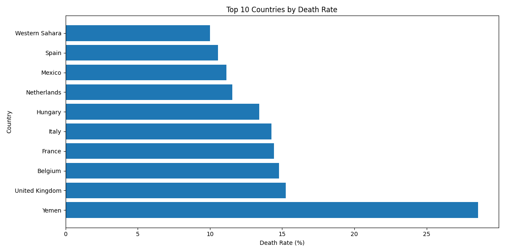
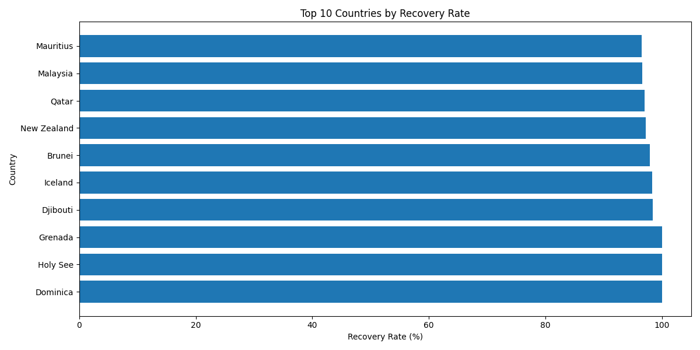
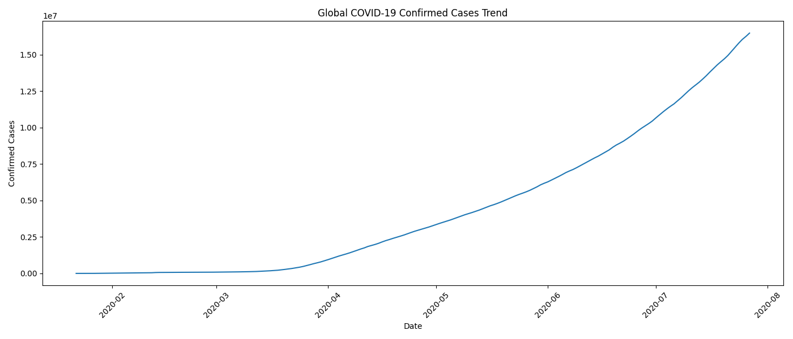
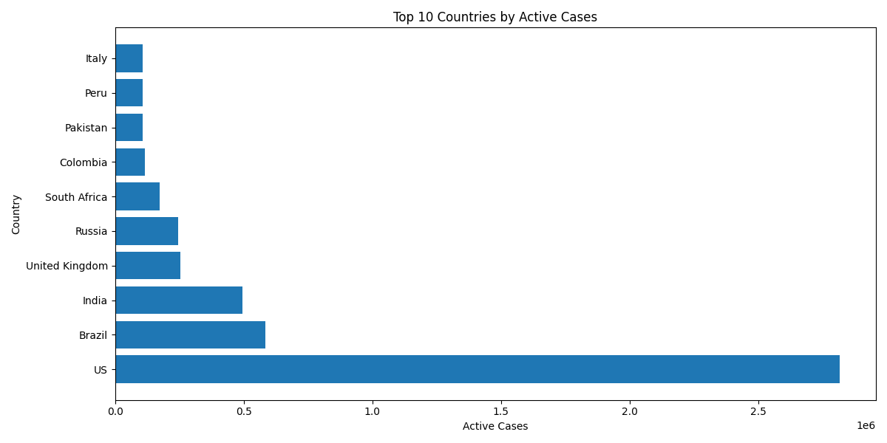
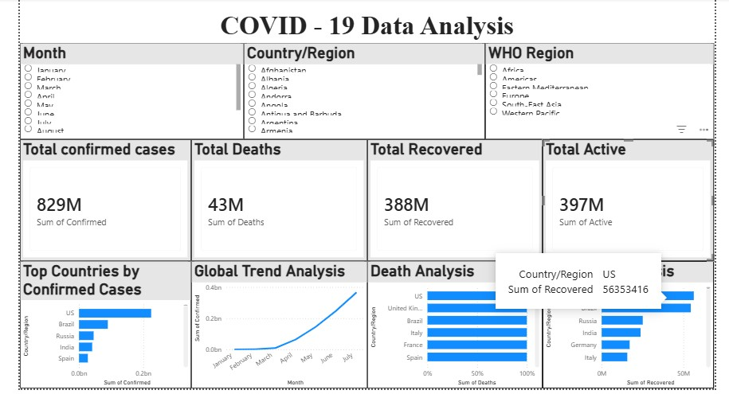

COVID-19 Data Analysis
----------------------
Overview
---------
Real-world data analysis project using a COVID-19 dataset to study global pandemic trends and country-wise performance.

This project analyzes confirmed cases, deaths, recovery rates, and active cases using Python data analysis and visualization techniques.

Dataset
--------

Source: Kaggle COVID-19 Dataset
Records: Global COVID-19 reports across multiple countries and dates
Features:
---------

Country/Region
Confirmed Cases
Deaths
Recovered Cases
Active Cases
Date-wise Reports
Tools & Technologies
--------------------
Python
Pandas
NumPy
Matplotlib
Analysis Performed
-------------------
Data Cleaning
Handling Missing Values
Date Conversion & Processing
Country-wise COVID Analysis
Death Rate Analysis
Recovery Rate Analysis
Active Cases Analysis
Global Trend Analysis
Data Visualization using Python
Key Insights
-------------
USA, India, and Brazil were among the highest affected countries.
Recovery rates improved significantly over time.
Some countries showed higher death rates despite lower confirmed cases.
Global confirmed cases increased rapidly during peak pandemic periods.
Active cases varied significantly across countries.

 Sample Visualizations
 ----------------------

 Top 10 Countries by Confirmed Cases

 Death Rate Analysis

 Recovery Rate Analysis

 Global COVID-19 Trend

 Active Cases Analysis

 Power BI Dashboard
 ------------------

The interactive Power BI dashboard includes:

- KPI Cards for Total Cases, Deaths, Recoveries
- Country-wise COVID Analysis
- Global Trend Visualization
- Active Cases Analysis
- Interactive Filters and Slicers

 Dashboard Preview
------------------

Conclusion
-----------
The project highlights how data analytics can be used to understand pandemic trends and compare country-wise COVID-19 performance.
